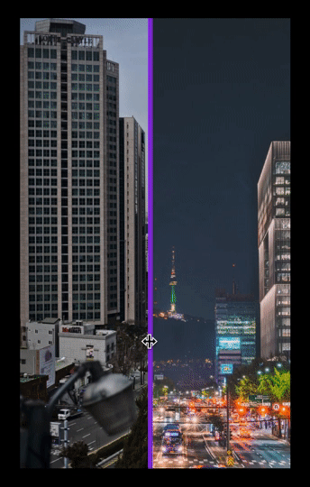

# What did I learned today

## What is it

**wdilt** aims to:

- encourage me to **learn something new** every day
- see my progression **over time**
- become **better**

> As much as possible related to the **front-end development**

## Generate a Markdown Calendar

```JavaScript
class Calendar(year, month)
```

### Parameters

- `year` : the year of the **month you choose**
- `month` : the **month** you choose

### Run it

- **Create** a new `Calendar` with specific parameters
- Add `.fill()` **method**
- run `node app.js` in a **large terminal** to see the **results**

__Exemple:__

```JavaScript
const December2018 = new Calendar(2018, 12).fill();
```

> You can see the result in markdown below ⬇️

# Progression

## January

| 🗓 |        Su       |        Mo       |        Tu       |        We       |        Tu       |        Fr       |        Sa       |
| -- | --------------- | --------------- | --------------- | --------------- | --------------- | --------------- | --------------- |
| W1 |                 |                 |[01](#2019-01-01)|[02](#2019-01-02)|[03](#2019-01-03)|[04](#2019-01-04)|[05](#2019-01-05)|
| W2 |[06](#2019-01-06)|[07](#2019-01-07)|[08](#2019-01-08)|[09](#2019-01-09)|[10](#2019-01-10)|[11](#2019-01-11)|[12](#2019-01-12)|
| W3 |[13](#2019-01-13)|[14](#2019-01-14)|[15](#2019-01-15)|[16](#2019-01-16)|[17](#2019-01-17)|[18](#2019-01-18)|[19](#2019-01-19)|
| W4 |[20](#2019-01-20)|[21](#2019-01-21)|[22](#2019-01-22)|[23](#2019-01-23)|[24](#2019-01-24)|[25](#2019-01-25)|[26](#2019-01-26)|
| W5 |[27](#2019-01-27)|[28](#2019-01-28)|[29](#2019-01-29)|[30](#2019-01-30)|[31](#2019-01-31)|                 |                 |

----

### 2019-01-01

Happy new year !

----

### 2019-01-02

Today I made a list of useful alias

```bash
# GLOBAL

alias a=alias
alias c=clear
alias cdc="cd && c"
alias e=exit
alias vs="&& code ."

# SHUTDOWN

alias bye="sudo shutdown -h now"

# REBOOT

alias rbt="sudo shutdown -r now"

# PACKAGE MANAGER

alias n=npm
alias ni="npm i"
alias nig="npm i -g"

alias y=yarn
alias ya="yarn add"
alias yga="yarn global add"
```

----

### 2019-01-03

Today I learned how to work with props, states, and localStorage

[Repository Here](https://github.com/blyndusk/quizzzy)

----

### 2019-01-04

Today I learned how specific React component method works:

- [`ComponentDidMount`](https://reactjs.org/docs/react-component.html#componentdidmount): invoked immediately after a component is mounted.
- [`ComponentDidUpdate`](https://reactjs.org/docs/react-component.html#componentdidupdate): invoked immediately after updating occurs. This method is not called for the initial render.
- [`UNSAFE_componentWillMount()`](https://reactjs.org/docs/react-component.html#unsafe_componentwillmount):  invoked just before mounting occurs. It is called before `render()`method.
- [`UNSAFE_componentWillReceiveProps()`](https://reactjs.org/docs/react-component.html#unsafe_componentwillreceiveprops): invoked before a mounted component receives new props.
- [`UNSAFE_componentWillUpdate()`](https://reactjs.org/docs/react-component.html#unsafe_componentwillupdate):  is invoked just before rendering when new props or state are being received. This method is not called for the initial render.

----

### 2019-01-05

Today I learned how to [deploy](https://facebook.github.io/create-react-app/docs/deployment) a project using [create-react-app](https://github.com/facebook/create-react-app) and [GitHub Pages](https://pages.github.com/)

----

### 2019-01-06

----

### 2019-01-07

----

### 2018-01-08

Today I learned how to use [GreenSock](https://greensock.com/), a **JS library** to make **easy animations**.

----

### 2019-01-09

Today I learned how to better use **props and states** in [React](https://reactjs.org/).

----

### 2019-01-10

Today I learned how to **display two pictures hidding one**. A picture is worth a thousand words:



Codepen [here](https://codepen.io/blyndusk/pen/JwmRjq).

----

### 2019-01-11

----

### 2019-01-12

Today I **teached** how to begin to make a **trivia**, using [React](https://reactjs.org/).

----

### 2019-01-13

Today I learned hwo to use `.splice(index, insert/replace, content)` to **re-sort an array**

----

### 2019-01-14

Today I learned how to export [iTerm2](https://www.iterm2.com/) profile:

`iTerm2 > Preferences > Profile > Other actions > Copy Profile as JSON`


```JSON
{
  "Working Directory" : "\/Users\/alexdll",
  "Prompt Before Closing 2" : false,
  "Selected Text Color" : {
    "Red Component" : 0,
    "Color Space" : "sRGB",
    "Blue Component" : 0,
    "Alpha Component" : 1,
    "Green Component" : 0
  },
  "Rows" : 25,
  "Ansi 11 Color" : {
    "Green Component" : 1,
    "Red Component" : 1,
    "Blue Component" : 0.3333333432674408
  },
  "Use Italic Font" : true,
  "Foreground Color" : {
    "Red Component" : 0.88987604156136513,
    "Color Space" : "sRGB",
    "Blue Component" : 0.2474365234375,
    "Alpha Component" : 1,
    "Green Component" : 1
  },
  "Right Option Key Sends" : 0,
  "Character Encoding" : 4,
  "Selection Color" : {
    "Red Component" : 1,
    "Color Space" : "sRGB",
    "Blue Component" : 1,
    "Alpha Component" : 1,
    "Green Component" : 1
  },
  "Blend" : 0.43562825520833331,
  "Mouse Reporting" : true,
  "Cursor Boost" : 0,
  "Ansi 4 Color" : {
    "Red Component" : 0.535491943359375,
    "Color Space" : "sRGB",
    "Blue Component" : 0.93395559582859278,
    "Alpha Component" : 1,
    "Green Component" : 1
  },
  "Non-ASCII Anti Aliased" : true,
  "Sync Title" : false,
  "Disable Window Resizing" : true,
  "Description" : "Default",
  "Close Sessions On End" : true,
  "Jobs to Ignore" : [
    "rlogin",
    "ssh",
    "slogin",
    "telnet"
  ],
  "Scrollback Lines" : 1000,
  "Prevent Opening in a Tab" : true,
  "Flashing Bell" : false,
  "Cursor Guide Color" : {
    "Red Component" : 0.70213186740875244,
    "Color Space" : "sRGB",
    "Blue Component" : 1,
    "Alpha Component" : 0.25,
    "Green Component" : 0.9268307089805603
  },
  "BM Growl" : true,
  "Ansi 3 Color" : {
    "Red Component" : 1,
    "Color Space" : "sRGB",
    "Blue Component" : 0,
    "Alpha Component" : 1,
    "Green Component" : 0.708343505859375
  },
  "Use Non-ASCII Font" : false,
  "Link Color" : {
    "Red Component" : 0.751312255859375,
    "Color Space" : "sRGB",
    "Blue Component" : 0,
    "Alpha Component" : 1,
    "Green Component" : 1
  },
  "Shortcut" : "",
  "Bold Color" : {
    "Green Component" : 1,
    "Red Component" : 1,
    "Blue Component" : 1
  },
  "Use Cursor Guide" : false,
  "Unlimited Scrollback" : true,
  "Custom Command" : "No",
  "Keyboard Map" : {
    "0xf700-0x260000" : {
      "Text" : "[1;6A",
      "Action" : 10
    },
    "0x37-0x40000" : {
      "Text" : "0x1f",
      "Action" : 11
    },
    "0x32-0x40000" : {
      "Text" : "0x00",
      "Action" : 11
    },
    "0xf709-0x20000" : {
      "Text" : "[17;2~",
      "Action" : 10
    },
    "0xf70c-0x20000" : {
      "Text" : "[20;2~",
      "Action" : 10
    },
    "0xf729-0x20000" : {
      "Text" : "[1;2H",
      "Action" : 10
    },
    "0xf72b-0x40000" : {
      "Text" : "[1;5F",
      "Action" : 10
    },
    "0xf705-0x20000" : {
      "Text" : "[1;2Q",
      "Action" : 10
    },
    "0xf703-0x260000" : {
      "Text" : "[1;6C",
      "Action" : 10
    },
    "0xf700-0x220000" : {
      "Text" : "[1;2A",
      "Action" : 10
    },
    "0xf701-0x280000" : {
      "Text" : "0x1b 0x1b 0x5b 0x42",
      "Action" : 11
    },
    "0x38-0x40000" : {
      "Text" : "0x7f",
      "Action" : 11
    },
    "0x33-0x40000" : {
      "Text" : "0x1b",
      "Action" : 11
    },
    "0xf703-0x220000" : {
      "Text" : "[1;2C",
      "Action" : 10
    },
    "0xf701-0x240000" : {
      "Text" : "[1;5B",
      "Action" : 10
    },
    "0xf70d-0x20000" : {
      "Text" : "[21;2~",
      "Action" : 10
    },
    "0xf702-0x260000" : {
      "Text" : "[1;6D",
      "Action" : 10
    },
    "0xf729-0x40000" : {
      "Text" : "[1;5H",
      "Action" : 10
    },
    "0xf706-0x20000" : {
      "Text" : "[1;2R",
      "Action" : 10
    },
    "0x34-0x40000" : {
      "Text" : "0x1c",
      "Action" : 11
    },
    "0xf700-0x280000" : {
      "Text" : "0x1b 0x1b 0x5b 0x41",
      "Action" : 11
    },
    "0x2d-0x40000" : {
      "Text" : "0x1f",
      "Action" : 11
    },
    "0xf70e-0x20000" : {
      "Text" : "[23;2~",
      "Action" : 10
    },
    "0xf702-0x220000" : {
      "Text" : "[1;2D",
      "Action" : 10
    },
    "0xf703-0x280000" : {
      "Text" : "0x1b 0x1b 0x5b 0x43",
      "Action" : 11
    },
    "0xf700-0x240000" : {
      "Text" : "[1;5A",
      "Action" : 10
    },
    "0xf707-0x20000" : {
      "Text" : "[1;2S",
      "Action" : 10
    },
    "0xf70a-0x20000" : {
      "Text" : "[18;2~",
      "Action" : 10
    },
    "0x35-0x40000" : {
      "Text" : "0x1d",
      "Action" : 11
    },
    "0xf70f-0x20000" : {
      "Text" : "[24;2~",
      "Action" : 10
    },
    "0xf703-0x240000" : {
      "Text" : "[1;5C",
      "Action" : 10
    },
    "0xf701-0x260000" : {
      "Text" : "[1;6B",
      "Action" : 10
    },
    "0xf702-0x280000" : {
      "Text" : "0x1b 0x1b 0x5b 0x44",
      "Action" : 11
    },
    "0xf72b-0x20000" : {
      "Text" : "[1;2F",
      "Action" : 10
    },
    "0x36-0x40000" : {
      "Text" : "0x1e",
      "Action" : 11
    },
    "0xf708-0x20000" : {
      "Text" : "[15;2~",
      "Action" : 10
    },
    "0xf701-0x220000" : {
      "Text" : "[1;2B",
      "Action" : 10
    },
    "0xf70b-0x20000" : {
      "Text" : "[19;2~",
      "Action" : 10
    },
    "0xf702-0x240000" : {
      "Text" : "[1;5D",
      "Action" : 10
    },
    "0xf704-0x20000" : {
      "Text" : "[1;2P",
      "Action" : 10
    }
  },
  "Ansi 14 Color" : {
    "Green Component" : 1,
    "Red Component" : 0.3333333432674408,
    "Blue Component" : 1
  },
  "Ansi 2 Color" : {
    "Red Component" : 0,
    "Color Space" : "sRGB",
    "Blue Component" : 0.452056884765625,
    "Alpha Component" : 1,
    "Green Component" : 1
  },
  "Background Image Is Tiled" : true,
  "Send Code When Idle" : false,
  "ASCII Anti Aliased" : true,
  "Tags" : [

  ],
  "Ansi 9 Color" : {
    "Green Component" : 0.3333333432674408,
    "Red Component" : 1,
    "Blue Component" : 0.3333333432674408
  },
  "Use Bold Font" : true,
  "Silence Bell" : false,
  "Ansi 12 Color" : {
    "Green Component" : 0.3333333432674408,
    "Red Component" : 0.3333333432674408,
    "Blue Component" : 1
  },
  "Window Type" : 0,
  "Use Bright Bold" : true,
  "Cursor Text Color" : {
    "Red Component" : 1,
    "Color Space" : "sRGB",
    "Blue Component" : 1,
    "Alpha Component" : 1,
    "Green Component" : 1
  },
  "Default Bookmark" : "No",
  "Cursor Color" : {
    "Red Component" : 1,
    "Color Space" : "sRGB",
    "Blue Component" : 0,
    "Alpha Component" : 1,
    "Green Component" : 0
  },
  "Ansi 1 Color" : {
    "Red Component" : 1,
    "Color Space" : "sRGB",
    "Blue Component" : 0,
    "Alpha Component" : 1,
    "Green Component" : 0
  },
  "Name" : "powerlevel9k-blynmac",
  "Blinking Cursor" : true,
  "Guid" : "1BE52892-24EE-4DEF-8773-5590356AF0CE",
  "Idle Code" : 0,
  "Ansi 10 Color" : {
    "Green Component" : 1,
    "Red Component" : 0.3333333432674408,
    "Blue Component" : 0.3333333432674408
  },
  "Ansi 8 Color" : {
    "Green Component" : 0.3333333432674408,
    "Red Component" : 0.3333333432674408,
    "Blue Component" : 0.3333333432674408
  },
  "Badge Color" : {
    "Red Component" : 1,
    "Color Space" : "sRGB",
    "Blue Component" : 0,
    "Alpha Component" : 0.5,
    "Green Component" : 0.1491314172744751
  },
  "Ambiguous Double Width" : false,
  "Blur Radius" : 14.28340934327411,
  "Cursor Type" : 0,
  "Ansi 0 Color" : {
    "Red Component" : 0.36253180541098118,
    "Color Space" : "sRGB",
    "Blue Component" : 0.76824951171875,
    "Alpha Component" : 1,
    "Green Component" : 0
  },
  "Blur" : true,
  "Vertical Spacing" : 1,
  "Normal Font" : "DroidSansMonoSlashedForPowerline 12",
  "Use Underline Color" : true,
  "Ansi 7 Color" : {
    "Red Component" : 0,
    "Color Space" : "sRGB",
    "Blue Component" : 0.091888427734375,
    "Alpha Component" : 1,
    "Green Component" : 1
  },
  "Command" : "",
  "Terminal Type" : "xterm-256color",
  "Horizontal Spacing" : 1,
  "Underline Color" : {
    "Red Component" : 0,
    "Color Space" : "sRGB",
    "Blue Component" : 0.6011962890625,
    "Alpha Component" : 1,
    "Green Component" : 1
  },
  "Tab Color" : {
    "Red Component" : 0,
    "Color Space" : "sRGB",
    "Blue Component" : 0.542388916015625,
    "Alpha Component" : 1,
    "Green Component" : 0.05316629633307457
  },
  "Only The Default BG Color Uses Transparency" : true,
  "Option Key Sends" : 0,
  "Blink Allowed" : true,
  "Ansi 15 Color" : {
    "Green Component" : 1,
    "Red Component" : 1,
    "Blue Component" : 1
  },
  "Minimum Contrast" : 0,
  "Ansi 6 Color" : {
    "Green Component" : 0.73333334922790527,
    "Red Component" : 0,
    "Blue Component" : 0.73333334922790527
  },
  "Transparency" : 0.25068012373096438,
  "Background Color" : {
    "Red Component" : 0.034468298777937889,
    "Color Space" : "sRGB",
    "Blue Component" : 0.095184326171875,
    "Alpha Component" : 1,
    "Green Component" : 0
  },
  "Screen" : -1,
  "Bound Hosts" : [

  ],
  "Non Ascii Font" : "Monaco 12",
  "Ansi 13 Color" : {
    "Green Component" : 0.3333333432674408,
    "Red Component" : 1,
    "Blue Component" : 1
  },
  "Use Tab Color" : true,
  "Columns" : 80,
  "Visual Bell" : true,
  "ASCII Ligatures" : true,
  "Ansi 5 Color" : {
    "Green Component" : 0,
    "Red Component" : 0.73333334922790527,
    "Blue Component" : 0.73333334922790527
  },
  "Custom Directory" : "No"
}
```
----

### 2019-01-15

Today I learned how to use `UNSAFE_componentWillUpdate()` inside [React](https://reactjs.org/).

----